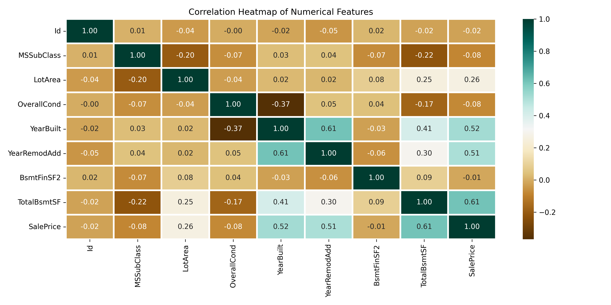
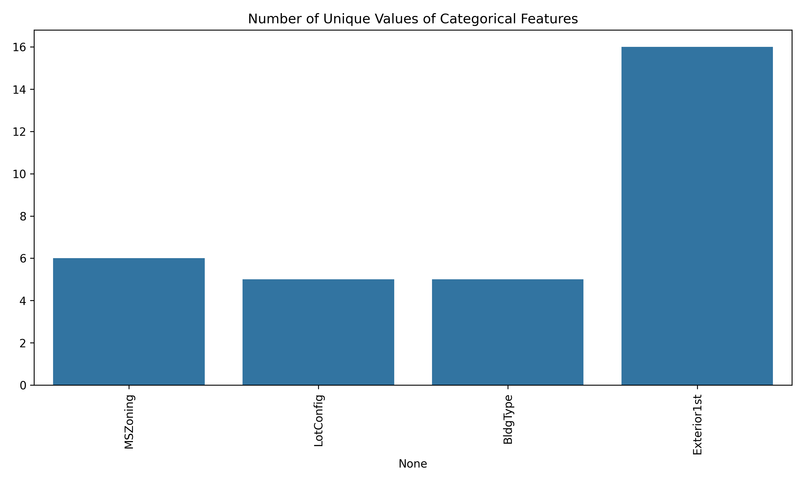
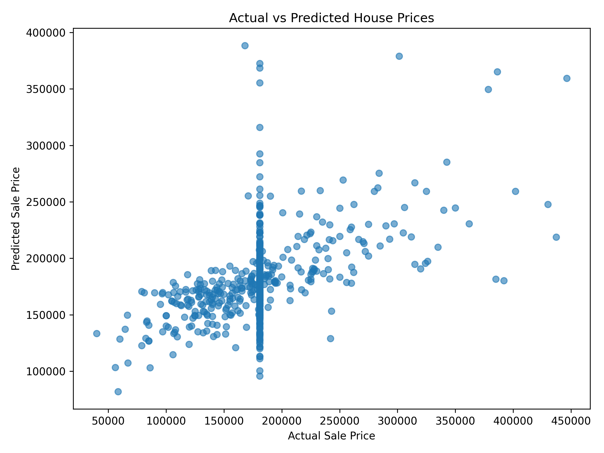

#  House Price Prediction Using Machine Learning

## Project Overview

This project develops and compares multiple machine learning regression models to predict house sale prices based on property characteristics.

The project demonstrates an end-to-end machine learning workflow including **data exploration, data cleaning, categorical feature encoding, model training, model evaluation, and visualization of predictions**.

Three regression algorithms are evaluated:

* Support Vector Regression (SVR)
* Random Forest Regression
* Linear Regression

The models are compared using **Mean Absolute Percentage Error (MAPE)** to determine which model performs best on the validation dataset.

---

##  Project Objective

The objective of this project is to build a machine learning pipeline capable of estimating house sale prices from property-related features and to compare the predictive performance of different regression algorithms.

The project focuses on:

* Understanding the structure and quality of housing data
* Identifying relationships between numerical variables
* Preparing categorical and numerical features for machine learning
* Training multiple regression models
* Comparing model performance using a consistent evaluation metric
* Visualizing actual versus predicted house prices

---

##  Dataset

The dataset contains housing characteristics and the corresponding **SalePrice**, which serves as the target variable.

Examples of features include:

* Lot Area
* MS Zoning
* Lot Configuration
* Building Type
* Overall Condition
* Year Built
* Year Remodeled
* Exterior Type
* Basement-related features
* Sale Price

`SalePrice` is the dependent variable that the machine learning models attempt to predict.

---

##  Exploratory Data Analysis

Before model development, exploratory data analysis was performed to better understand the dataset.

### Correlation Analysis

A correlation heatmap was created for numerical variables to examine relationships between housing characteristics and identify features associated with sale price.



### Categorical Feature Analysis

The number of unique categories within each categorical variable was analyzed to understand feature cardinality before encoding.



---

##  Data Preprocessing

Several preprocessing steps were performed before training the models.

### 1. Removed Identifier

The `Id` column was removed because it acts primarily as a unique record identifier rather than a meaningful predictive feature.

### 2. Missing Values

Missing values in the target variable were filled using the mean SalePrice.

Rows containing remaining missing values were removed to create a clean modeling dataset.

### 3. Categorical Feature Encoding

Machine learning algorithms require numerical input.

Categorical variables were therefore transformed using:

**One-Hot Encoding**

The `OneHotEncoder` from Scikit-learn was used with unknown-category handling enabled.

### 4. Feature and Target Separation

The dataset was divided into:

* **X** — predictor variables
* **y** — SalePrice target variable

### 5. Train-Validation Split

The processed dataset was divided into:

* **80% Training Data**
* **20% Validation Data**

A fixed `random_state=0` was used to improve reproducibility.

---

##  Machine Learning Models

Three regression algorithms were trained and evaluated.

### Support Vector Regression

Support Vector Regression attempts to find a function that predicts continuous values while maintaining an acceptable prediction error margin.

### Random Forest Regression

Random Forest combines predictions from multiple decision trees. This allows the model to capture nonlinear relationships between housing characteristics and sale prices.

For this project, the Random Forest model was configured with:

`n_estimators = 10`

### Linear Regression

Linear Regression provides a baseline model by estimating a linear relationship between the predictor variables and house sale prices.

---

##  Model Evaluation

Model performance was evaluated using **Mean Absolute Percentage Error (MAPE)**.

MAPE measures the average percentage difference between predicted and actual values.

**Lower MAPE indicates better predictive performance.**

The results generated by the models are automatically saved to:

`model_results.csv`

This makes it easy to compare model performance after each execution.


##  Model Performance

The three regression models were evaluated using **Mean Absolute Percentage Error (MAPE)**. A lower MAPE indicates better predictive performance.

| Model                        |         MAPE |   MAPE (%) |
| ---------------------------- | -----------: | ---------: |
| **Random Forest Regression** | **0.184968** | **18.50%** |
| Support Vector Regression    |     0.187051 |     18.71% |
| Linear Regression            |     0.187417 |     18.74% |

###  Best Performing Model: Random Forest Regression

**Random Forest Regression achieved the lowest MAPE of 0.184968 (18.50%)**, making it the best-performing model among the three models tested.

This means that, on the validation dataset, the Random Forest predictions differed from the actual house sale prices by approximately **18.5% on average**.

The results show:

* **Random Forest Regression:** 18.50% MAPE
* **Support Vector Regression:** 18.71% MAPE
* **Linear Regression:** 18.74% MAPE

Although the differences between the three models are relatively small, Random Forest produced the lowest prediction error.

###  Key Findings

* Random Forest achieved the best predictive performance of the three tested models.
* All three models produced MAPE values within a relatively narrow range of approximately **18.5%–18.7%**.
* Random Forest's slight advantage suggests that nonlinear relationships and interactions between housing characteristics may provide useful predictive information.
* The small performance gap means stronger validation, such as cross-validation, would be useful before concluding that Random Forest will consistently outperform the other models on unseen data.
* Further improvements could include hyperparameter tuning, feature scaling, improved missing-value treatment, additional feature engineering, and testing gradient-boosting algorithms.

---

##  Actual vs. Predicted House Prices

The predictions from the Random Forest model were visualized against the actual house sale prices.



Points closer to the ideal diagonal relationship represent predictions that are closer to the actual sale prices.

---

##  Technologies Used

| Technology    | Purpose                               |
| ------------- | ------------------------------------- |
| Python        | Programming language                  |
| Pandas        | Data manipulation and preprocessing   |
| NumPy         | Numerical operations                  |
| Matplotlib    | Data visualization                    |
| Seaborn       | Statistical visualization             |
| Scikit-learn  | Machine learning and model evaluation |
| OneHotEncoder | Categorical feature transformation    |
| Excel         | Source dataset format                 |
| Git           | Version control                       |
| GitHub        | Project hosting                       |

---

##  Project Structure

```text
House-Price-Prediction-ML/
│
├── Data/
│   └── HousePricePrediction.xlsx
│
├── Images/
│   ├── actual_vs_predicted.png
│   ├── categorical_unique_values.png
│   └── correlation_heatmap.png
│
├── house_price_prediction.py
├── model_results.csv
├── requirements.txt
├── .gitignore
└── README.md
```

---

##  How to Run the Project

### 1. Clone the repository

```bash
git clone https://github.com/Rubaiyat24/House-Price-Prediction-ML.git
```

### 2. Navigate to the project directory

```bash
cd House-Price-Prediction-ML
```

### 3. Install required libraries

```bash
pip install -r requirements.txt
```

### 4. Run the machine learning pipeline

```bash
python house_price_prediction.py
```

The script will:

1. Load the housing dataset
2. Examine the dataset and missing values
3. Perform exploratory data analysis
4. Generate visualizations
5. Clean the dataset
6. Encode categorical features
7. Split the data into training and validation sets
8. Train three regression models
9. Calculate MAPE for each model
10. Save the model comparison results
11. Generate an Actual vs. Predicted visualization

---

##  Key Takeaways

This project demonstrates how raw housing data can be transformed into a structured machine learning workflow.

Key skills demonstrated include:

* Exploratory Data Analysis
* Data Cleaning
* Missing Value Handling
* Feature Engineering
* One-Hot Encoding
* Train-Test Splitting
* Regression Modeling
* Model Comparison
* Performance Evaluation
* Data Visualization
* Python Project Organization
* Git/GitHub Version Control

---

##  Potential Improvements

Future versions of the project could include:

* Hyperparameter tuning with GridSearchCV or RandomizedSearchCV
* Cross-validation
* Additional models such as XGBoost or Gradient Boosting
* Feature importance analysis
* Additional evaluation metrics such as MAE, RMSE and R²
* Feature scaling for SVR
* More robust missing-value imputation
* Scikit-learn pipelines to reduce preprocessing leakage
* A web interface where users can enter property characteristics and receive predicted prices

---

##  Author

**Rubaiyat Tabassum**

Machine Learning & Data Analytics Portfolio Project

## Acknowledgement

This project was developed as a machine learning practice project based on the House Price Prediction workflow presented by GeeksforGeeks, with additional project organization, model comparison, result export, and visualization.
